# Flowchart Generator Skill

## Purpose

Generate clear, structured, and valid flowcharts from natural-language descriptions.

This skill is designed for:

- Software architecture diagrams
- AI-agent workflows
- Business processes
- Authentication flows
- API request flows
- Data pipelines
- Decision trees
- System workflows
- Agent orchestration diagrams

The primary output format is Mermaid `flowchart`.

## When to Use

Use this skill when the user asks to:

- Create a flowchart
- Visualize a process
- Visualize an AI-agent workflow
- Visualize system architecture
- Convert requirements into a diagram
- Explain a workflow visually
- Show how multiple agents communicate
- Show an orchestration or execution pipeline

## Input

Accept natural-language descriptions such as:

- "Create an authentication flow."
- "Show how my AI agents communicate."
- "Create a flowchart for order processing."
- "Visualize my Expo app to API architecture."
- "Create a multi-agent coding workflow."

## Workflow

Follow these steps:

1. Understand the requested workflow.
2. Identify the major actors and components.
3. Identify processes and actions.
4. Identify decision points.
5. Identify inputs and outputs.
6. Identify external services and systems.
7. Identify databases or persistent storage.
8. Identify error, retry, and failure paths when relevant.
9. Determine an appropriate flow direction.
10. Assign a unique ID to every node.
11. Create edges between related nodes.
12. Add labels to conditional edges.
13. Generate Mermaid syntax.
14. Validate that every edge references an existing node.
15. Remove unnecessary complexity.
16. Return the final flowchart.

## Node Conventions

Use concise node labels.

### Process

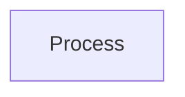

### Decision

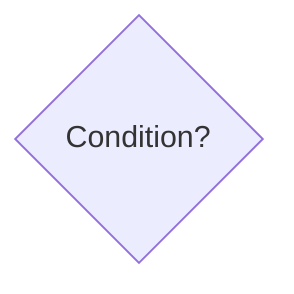

### Start / End

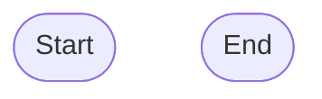

### Database

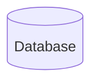

### External System

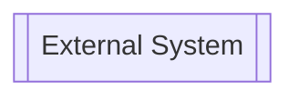

### AI Agent

Represent specialized agents as process-style nodes:

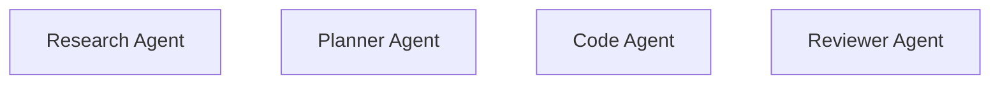

## Edge Conventions

### Normal flow


### Conditional flow

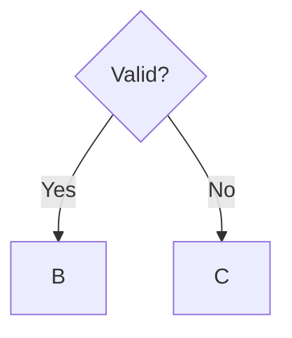

### Return flow

Use a backward connection when an agent or process returns information:

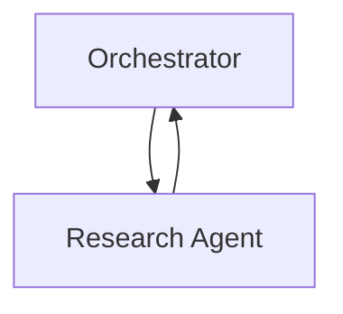

### Retry loop

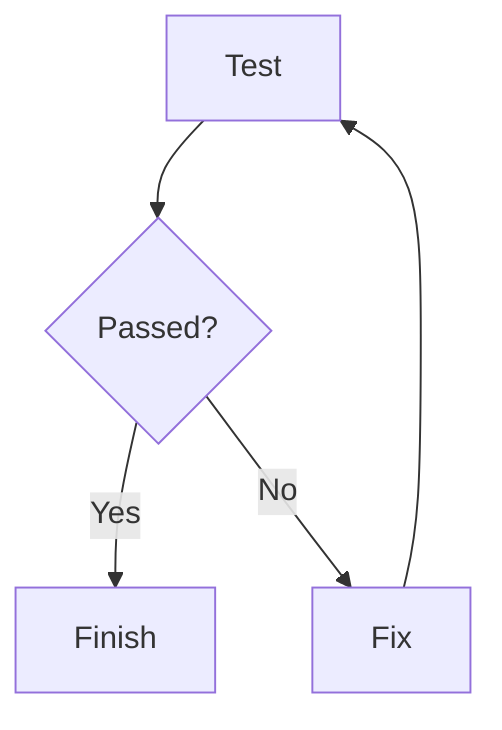

## AI-Agent Workflows

When creating an AI-agent flowchart, look for these components:

- User
- Orchestrator / Planner
- Specialized agents
- Tools
- Memory
- Shared state
- External APIs
- Databases
- Human approval
- Validation
- Retry mechanisms
- Final output

Example:

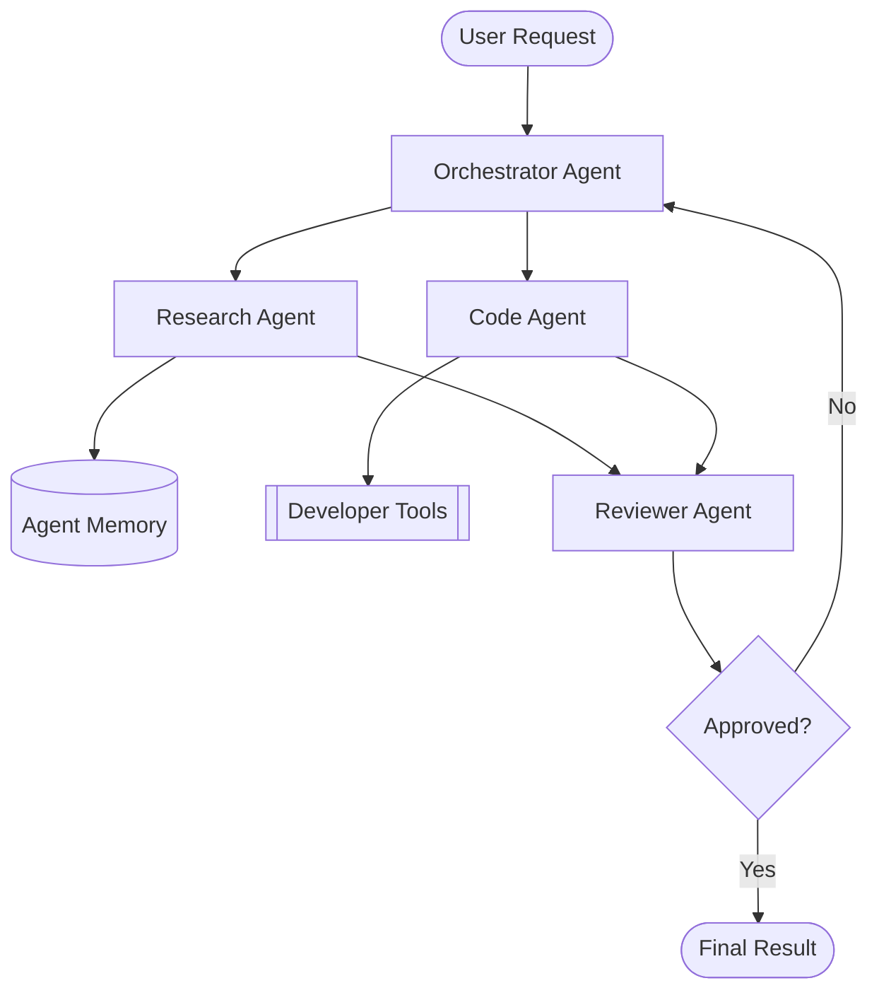

## Agent Skill vs Tool

When modeling an AI system, distinguish between skills and tools.

### Skill

A skill describes what an agent knows how to do.

Examples:

- Research
- Summarization
- Code generation
- Testing
- Planning
- Flowchart generation

### Tool

A tool represents an external capability available to an agent.

Examples:

- Browser
- Filesystem
- Terminal
- GitHub API
- Database
- HTTP API

For example:

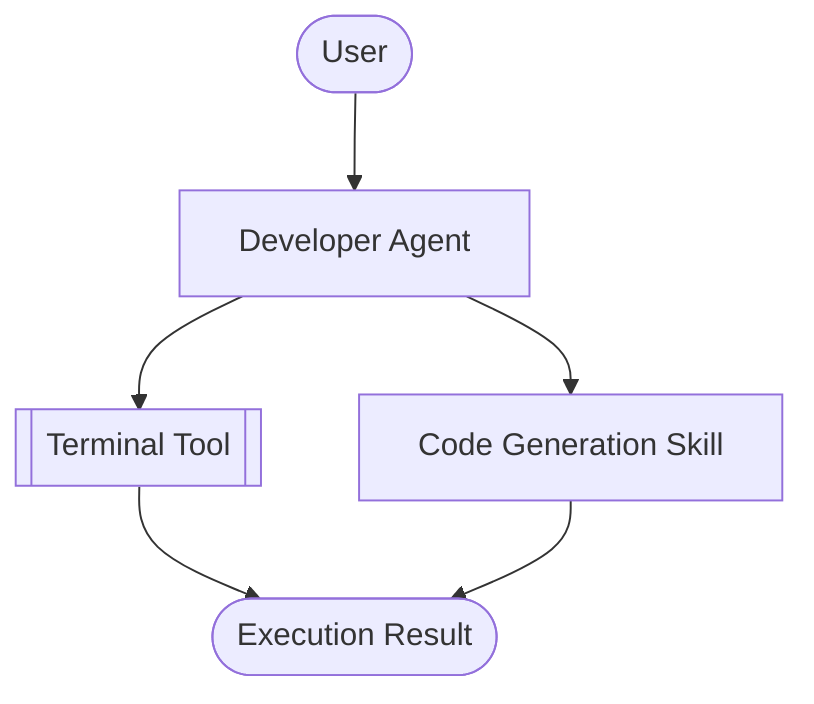

## Orchestrator Pattern

For multi-agent systems, prefer an orchestrator when one component decides which agent should execute next.

Example:

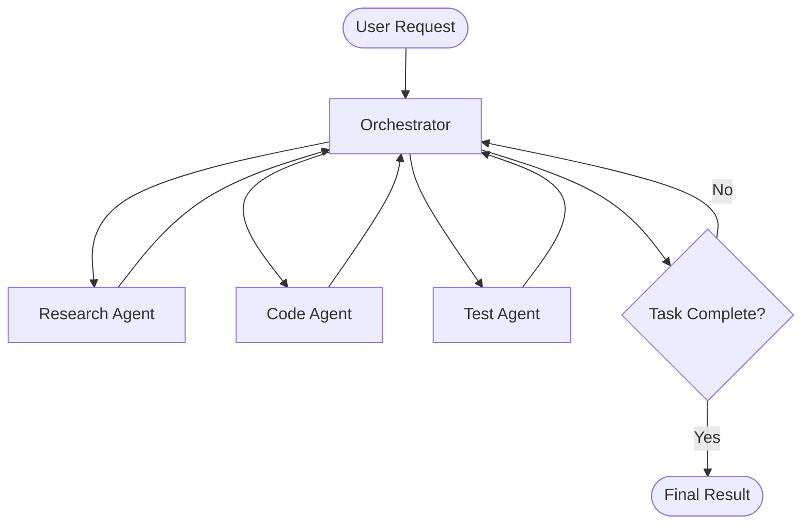

## Sequential Agent Pattern

Use this when agents execute in a fixed sequence.

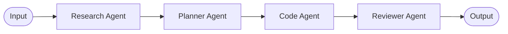

## Parallel Agent Pattern

Use this when independent agents can work simultaneously.

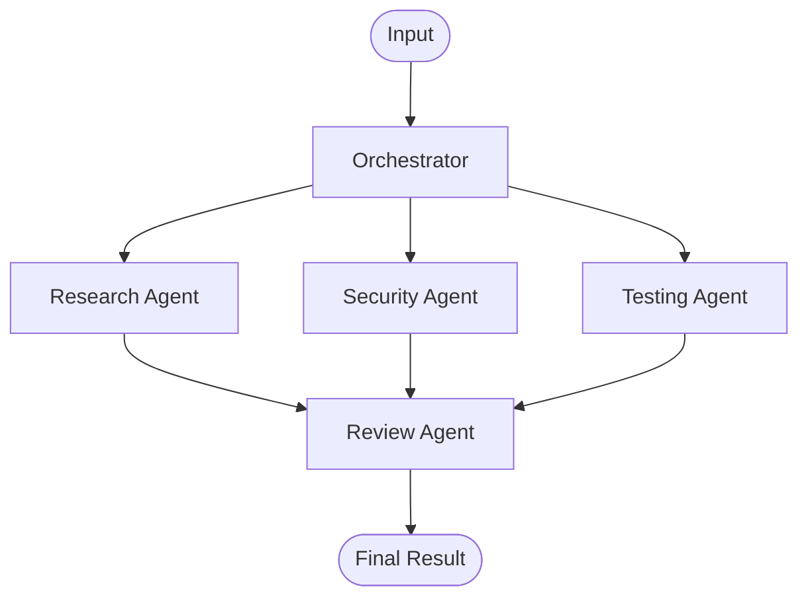

## Human-in-the-Loop Pattern

Represent human approval explicitly when required.

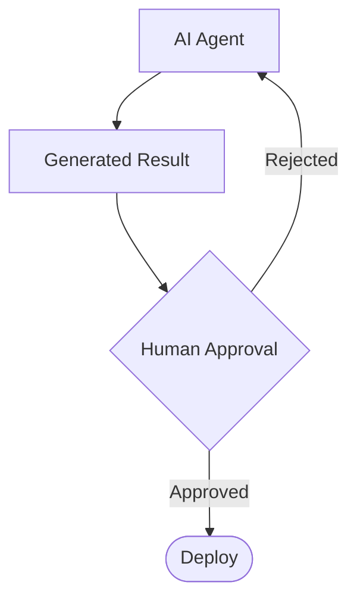

## Error Handling

Include failure paths when they are important to understanding the workflow.

Example:

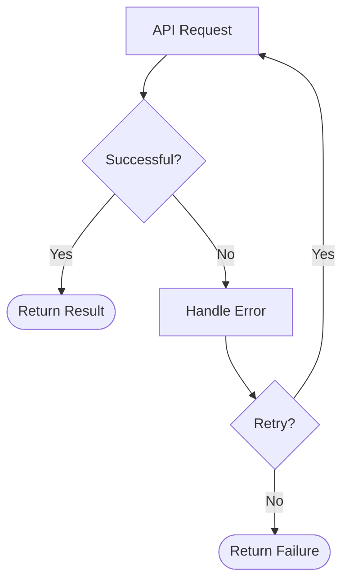

Do not add speculative error paths when they are irrelevant.

## Layout Selection

Choose the layout based on complexity.

### Use `LR`

For simple sequential workflows:

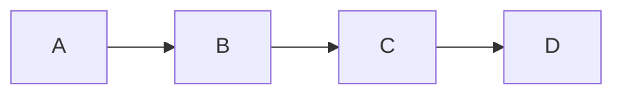

### Use `TD`

For branching, agent orchestration, or complex workflows:

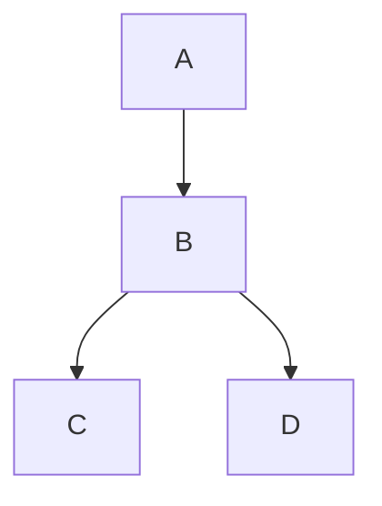

## Validation Rules

Before returning a Mermaid flowchart, verify:

- Every node has a unique ID.
- Every edge references existing node IDs.
- Decision branches have meaningful labels.
- There are no accidental duplicate IDs.
- The graph represents the user's intended workflow.
- Loops are intentional.
- Failure paths do not obscure the main path.
- Labels are concise.
- Mermaid syntax is valid.
- The diagram is not unnecessarily complicated.

## Handling Ambiguous Requirements

If the user's description is incomplete:

1. Infer only relationships that are obvious.
2. Do not invent business rules.
3. Do not invent agents or services unless necessary for the requested visualization.
4. Make reasonable structural assumptions when they do not materially alter the meaning.
5. Ask a clarification question only when the missing information materially changes the workflow.

## Output Format

Normally return:

1. A short statement describing the interpreted workflow.
2. The Mermaid flowchart.
3. Important assumptions, if any.

Example:

```text
The workflow uses an orchestrator to delegate work to research and coding agents, followed by validation.

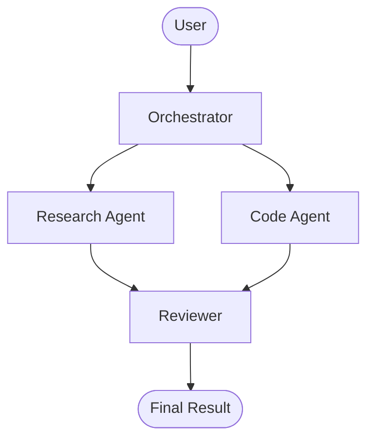

Assumption: the reviewer receives results from both specialized agents.
```

## Quality Guidelines

Prefer clarity over visual complexity.

Good:

```mermaid
flowchart TD
    A[User] --> B[Orchestrator]
    B --> C[Research Agent]
    C --> D[Reviewer]
    D --> E[Result]
```

Avoid unnecessarily detailed diagrams such as:

- Every function call
- Every HTTP header
- Every variable
- Every internal implementation detail
- Repeated nodes
- Decorative nodes that provide no information

Only include implementation-level details when the user specifically requests them.

## Recommended Extensions

When integrating this skill into an agent platform, the skill can be combined with:

- A Mermaid renderer
- A graph editor
- React Flow
- A diagram export tool
- An image generation tool
- A filesystem tool
- A documentation generator

The skill itself should remain focused on understanding workflows and producing a structured flowchart representation.
